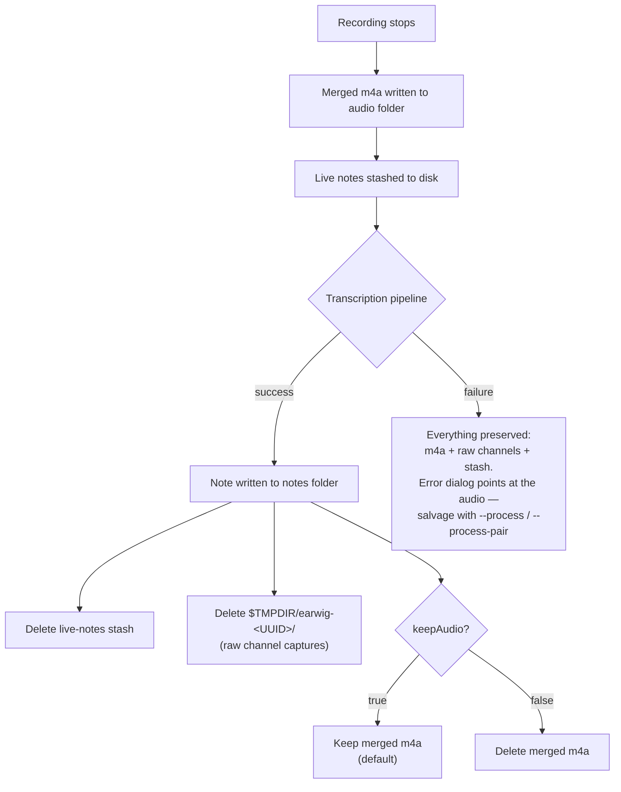

# Audio storage and cleanup

Everything stays on-device. Meeting audio and transcripts can contain
sensitive content — treat the notes folder and its `audio/` subfolder as
confidential.

Folder locations are configurable in `config.json`; the defaults below assume
`notesFolder: ~/MeetingNotes` and `audioFolder: ~/MeetingNotes/audio`.

## Where files live

| File | Location | Written | Cleaned up |
|---|---|---|---|
| Raw channel captures (`mic.caf`, `system.caf`) | `$TMPDIR/earwig-<UUID>/` | during recording | deleted after a successful pipeline run; kept on failure for salvage; macOS purges old temp files itself |
| Merged recording (`meeting-<stamp>.m4a`) | `~/MeetingNotes/audio/` | at recording stop, before transcription starts | kept forever if `keepAudio: true` (default); deleted right after the note is written if `keepAudio: false`; always kept if the pipeline fails |
| Live-notes stash (`meeting-<stamp>-livenotes.txt`) | `~/MeetingNotes/audio/` | at recording stop (only if the user typed notes) | deleted once the note is written; kept on failure so typed notes are never lost |
| Speaker sample clips (`meeting-<stamp>-speakers/*.m4a`) | `~/MeetingNotes/audio/` | during transcription | never auto-deleted — the note's `speaker_samples` frontmatter references them |
| Voice catalogue (`speakers.json` + `Speakers/<UUID>.m4a`) | `~/Library/Application Support/Earwig/` | when a new voice is registered | a voice's clip is deleted when its record is deleted in Settings → Speaker Identification |
| Speech models (Whisper ~1.5 GB, diarizer) | `~/Library/Application Support/Earwig/Models/` | downloaded on first use | never — delete manually to reclaim space (re-downloaded on demand) |
| Meeting notes (`meeting-<stamp>.md`) | `~/MeetingNotes/` | end of pipeline | never — they are the product |
| Log (`earwig.log`) | `~/Library/Application Support/Earwig/` | continuously | never rotated; truncate manually if it grows large |

`<stamp>` is the recording's start time, `yyyy-MM-dd-HHmm`.

## Cleanup flow

Cleanup is deliberately conservative: nothing is deleted until the note is
safely on disk, and a failed pipeline deletes nothing at all.

Two details worth knowing:

- **Quitting mid-transcription is safe.** The merged m4a is written before
  transcription begins, so a queued recording survives an app quit or crash —
  re-run it with `Earwig --process <audio.m4a>`.
- **Nothing prunes the audio folder.** With `keepAudio: true`, every meeting's
  m4a (~2 MB/min) and speaker-sample clips accumulate indefinitely; archive or
  delete old ones manually when disk space matters.
