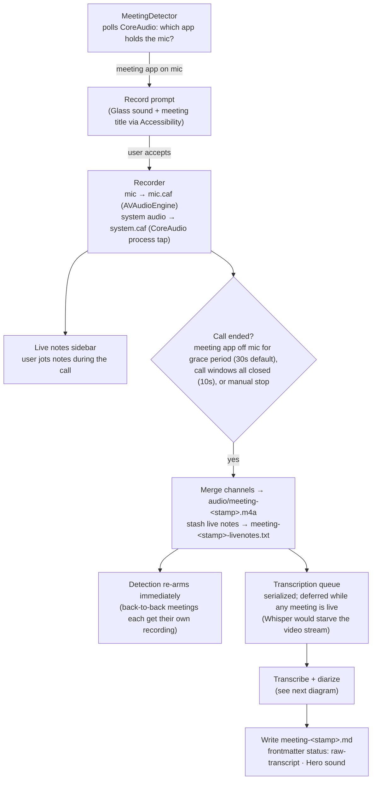
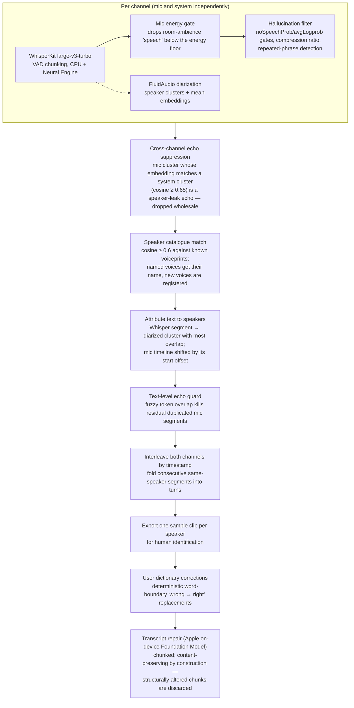

# The processing pipeline

How a meeting goes from "an app grabbed the microphone" to a markdown note in
the notes folder. File locations and retention are covered in
[audio-storage.md](audio-storage.md).

## Meeting lifecycle

Downstream of the note, summarisation and action items are owned by a separate
project watching the notes folder — Earwig deliberately stops at the raw
transcript.

## Transcription and diarization

The preferred path processes the two channels separately: the system channel
is clean remote voices, the mic channel is the local speaker. Each falls back
gracefully — two-channel → merged single-channel Whisper → Apple
SpeechAnalyzer (macOS 26+) → SFSpeechRecognizer.

> **Why the dictionary never primes Whisper:** conditioning WhisperKit 1.0.0's
> decoder with a prompt (any size, all confidence gates disabled) makes it end
> windows early and silently drop most real speech — measured 12,085 → ~1,800
> chars on the same 17-minute meeting. The dictionary is applied only after
> transcription: deterministic corrections and the repair model's glossary.
> See the NOTE in `Transcriber.swift` before re-adding priming.

## Salvage CLI

Every stage's inputs are preserved on failure, so the pipeline can be re-run
headless:

| Command | Use |
|---|---|
| `Earwig --process <audio.m4a>` | Re-run the full pipeline on a merged recording |
| `Earwig --process-pair <mic> <system> [offset]` | Re-run the two-channel pipeline on raw channel captures |
| `Earwig --merge <out.m4a> <in1> [in2 …]` | Mix stray channel files into one m4a |
| `Earwig --repair-note <note.md>` | Re-apply dictionary corrections + on-device repair to an existing note |
